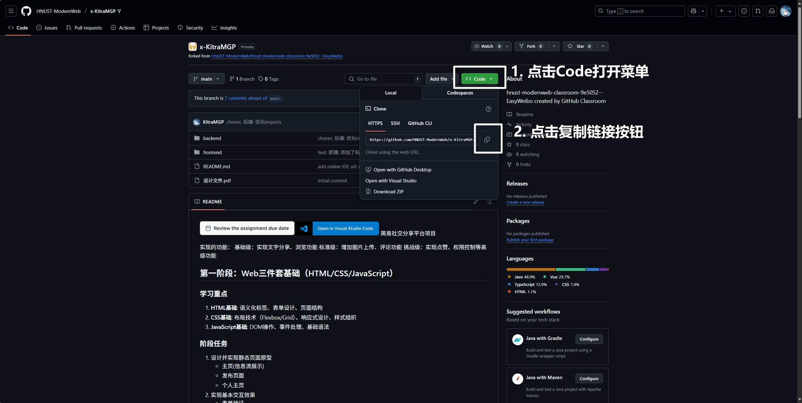

# 《高级Web技术》实验和课程设计指导书

本指导书可以帮助你从0开始搭建一个基于Vue.js和Spring Boot的前后端分离工程，并提交到GitHub仓库中。

项目前端使用Vue3框架和Element Plus组件库。后端使用Spring Boot、MyBatis，使用Gradle作为构建工具，使用MySQL 8.4作为数据库。

本教程假定你使用的操作系统是Windows。

## 0. 开始之前的准备工作

**需要安装的软件：**

- [Visual Studio Code](https://code.visualstudio.com/)（适合用于前端开发，是Vue推荐使用的开发工具）
- [IntelliJ IDEA](https://www.jetbrains.com/idea/download/?section=windows)（专业的Java集成开发环境，适合用于后端开发）
  - 建议下载Ultimate版本，功能更强大，在官网进行学生认证后可以免费使用
- [Git](https://registry.npmmirror.com/binary.html?path=git-for-windows/v2.49.0.windows.1/)（最流行的版本管理工具，必须安装Git才能操作Git仓库，将项目提交到GitHub；Git记录你每次提交代码的历史记录，你可以轻松查看文件修改历史或回退到之前的版本；它还可以实现多人协作开发）
  - 打开网页后，请下载第一个exe文件（Git-2.49.0-64-bit.exe）
  - **为了避免其他软件无法自动识别到Git，建议把Git安装在默认位置！**
- [Node.js](https://nodejs.org/zh-cn)（前端开发用到的各种工具，都依赖Node.js运行环境才能使用）

- [Java17 JDK](https://www.azul.com/downloads/?version=java-17-lts&os=windows&architecture=x86-64-bit&package=jdk#zulu)（如果你的电脑上没有合适的JDK，请点击链接下载，请下载.msi格式安装包并安装）
  - 安装完成后，打开终端输入`java --version`命令来检查是否已正确安装，若成功打印出关于OpenJDK版本的信息，则代表安装成功
- [MySQL](https://dev.mysql.com/downloads/mysql/)（如果你电脑上已经有MySQL了则不用安装，若没有请点击链接，选择8.4.4 LTS版本下载）
- [Navicat Premium Lite](https://www.navicat.com.cn/products/navicat-premium-lite)（Navicat的免费版，用来查看和操作数据库，在软件里免费注册账号并登录即可使用）
- [ApiFox](https://apifox.com/)（可用于API开发、测试和Mock，全中文界面，比Postman更加强大）

**此外，你还需要：**

- 对Web技术的兴趣
- 一定的耐心。

对新手来说，第一次开发Web项目会让你接触到大量陌生的技术和名词，若想顺利完成整个工程，你需要足够的耐心。

但当你的项目真正运行起来的那一刻，无比的成就感将会涌上心头。

## 1. 软件的初始设置

**VSCode的设置：**

打开VSCode，你首先需要安装一下做前端开发必备的插件：

- Chinese (Simplified) (简体中文) Language Pack for Visual Studio Code
- HTML CSS Support
- Live Server（在做原生前端开发的时候可以用来实时预览HTML）
- Vue - Official（Vue官方支持插件）

**IDEA的设置：**

- 建议进入插件市场下载中文包

## 2. 初始化Git本地仓库（从GitHub上克隆你的仓库）

> 进行这一步的原因是：要向网络上的Git仓库提交代码，应该将仓库克隆到本地，在其中编写自己的代码，然后提交到本地仓库，并推送到远程仓库。
>
> 建议上网搜索关于Git的介绍视频，了解Git的基本原理。

首先在GitHub上找到你的实验2代码仓库并打开，点击绿色的**Code**按钮然后点击复制按钮复制仓库的HTTPS链接：



然后在你电脑上用来存放项目的文件夹里打开终端，执行以下命令：

````
git clone <刚刚复制的链接>
````

此时会开始从GitHub上下载你的仓库，期间可能会要求你通过浏览器登录GitHub，按照指导操作即可。

> 若因为网络问题导致无法克隆，请使用代理服务器（科学上网）。请上网搜索“git设置http代理”了解让Git连接代理服务器的方法。

克隆完成后，在电脑上打开刚刚克隆的仓库文件夹，文件夹的内容应该和GitHub网站上显示的内容相同。

为了能够正常将自己的更改提交到远程仓库，需要设置一下Git的用户名和邮箱。参照这篇教程：[如何配置 Git 用户名和邮件地址](https://zhuanlan.zhihu.com/p/120862483)。你只需要设置全局用户名和邮箱即可。

## 3. 开发前的准备工作

请在仓库的根目录创建`frontend`和`backend`两个文件夹，分别存放前端和后端项目。

前端和后端是两个独立的项目，在各自的文件夹分别管理可以避免混乱，方便使用。

## 4. 创建前端项目

// 使用vue-cli来创建前端项目
这里还可以写一些东西

## 5. 创建后端项目

// TODO

## 6. 后续工作：打包和部署

// TODO

